Manual básico de usuario
========================================

En este manual básico de usuario sobre la aplicación MisterFut se van a tratar los siguientes puntos:

### Registrarse

Para registrarnos en la aplicación, primero tenemos que pulsar en la opción del menú "Usuarios" y después en la opción "Registrarse". Esta opción nos llevara a un formulario de registro. En el que tendremos que rellenar los campos que aparecen para registrarnos en la aplicación.

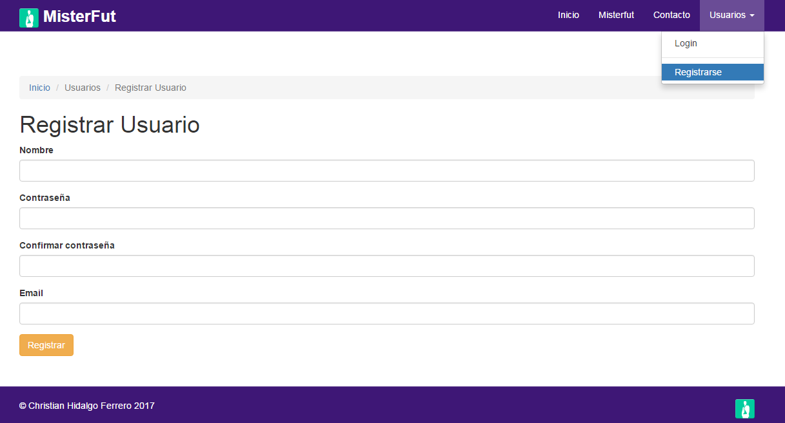

-----------------------------------------------
### Login

Una vez nos hayamos registrado en la aplicación podremos loguearnos. Esta acción la realizaremos desde el formulario al que se nos redireccionara o desde la opción del menú de "Usuarios", en la opción "Login".

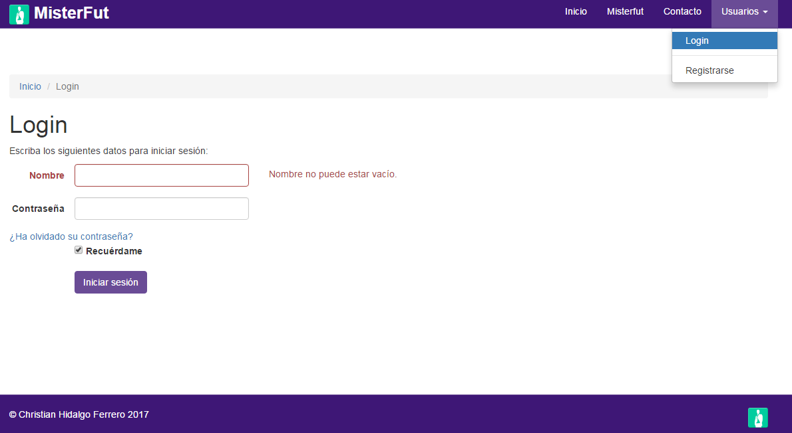

-----------------------------------------------
### Logout

Cerrar sesión es tan sencillo como pulsar sobre la opción de logout que aparecerá en el menú de "Usuario" cuando estemos logueados.

-----------------------------------------------
### Ver datos de usuario

Para ver los datos de usuario, tienes que pulsar sobre la opción de "Usuario" del menú y dentro sobre la opción de "Mis datos".

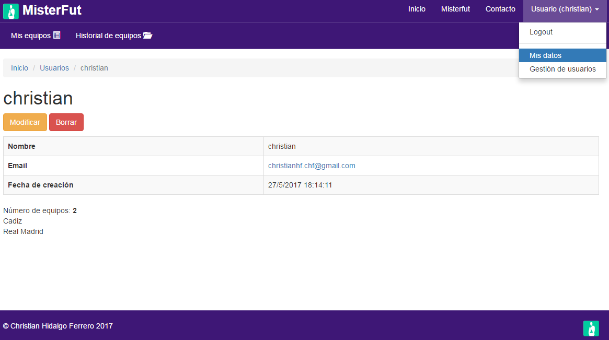

-----------------------------------------------
### Modificar datos de usuario

Para modificar los datos de usuario, tienes que pulsar sobre el botón de "Modificar" que aparece en la pantalla de visualización de tus datos de usuario, y se abrira en pantalla el formulario de modificación de los datos de usuario.

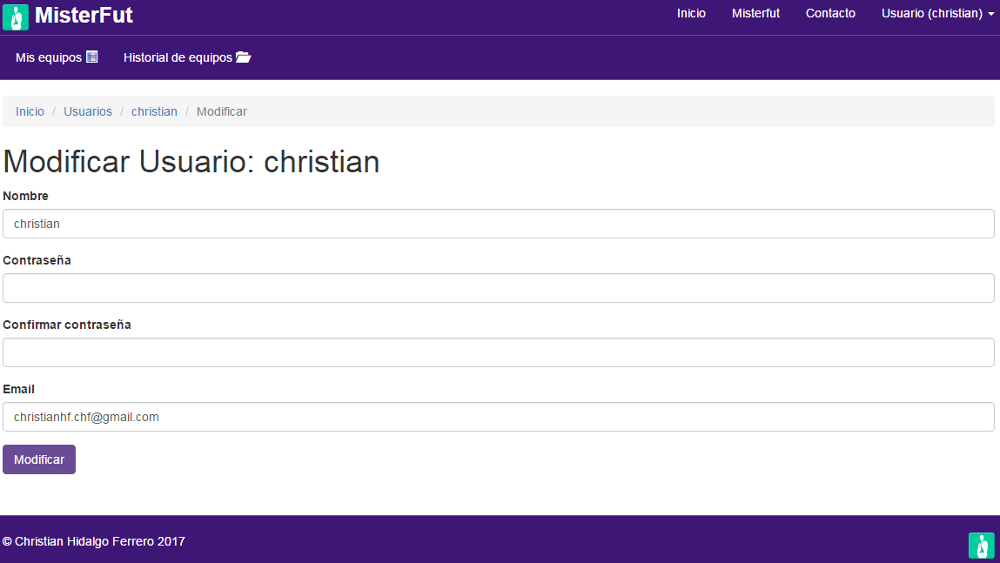

-----------------------------------------------
### Recuperar contraseña

Si estas registrado en la aplicación pero te has olvidado de la contraseña, la puedes recuperar pulsando en la opción "¿Ha olvidado su contraseña?" que aparece debajo del formulario de login.

Al pulsar sobre ella aparecerá un formulario que le pedira que introduzca el email con el que se registro en la aplicación.

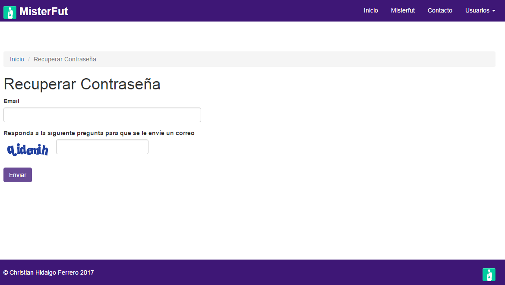

Si el email introducido es correcto, se enviara un correo electrónico al email indicado. El enlace que se ha enviado a tu correo te redireccionara a una página desde la que podras cambiar tu contraseña por una nueva.

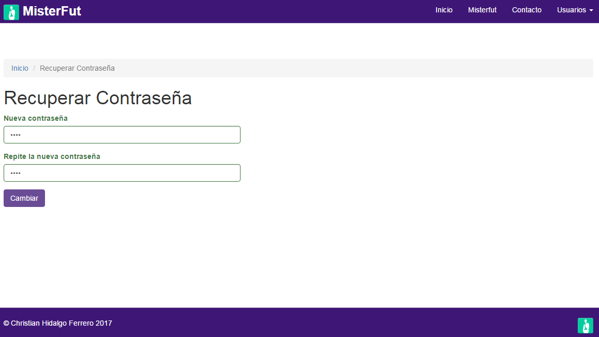

-----------------------------------------------
### Añadir y modificar equipo

Una vez estes logueado aparecerá un submenú con las opciones de "Mis equipos" y "Historial de equipos".

Pulsando en la opción de "Mis equipos" te aparecerá una tabla con todos los equipos a los que has entrenado y sus estadísticas, independientemente de la temporada.

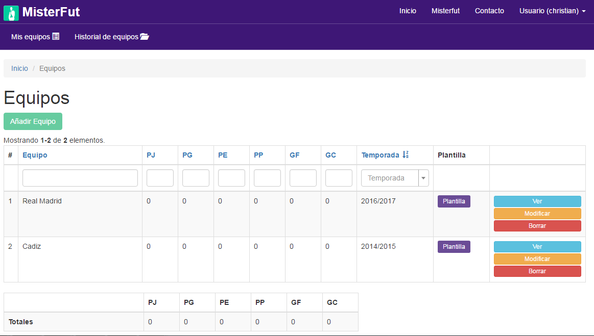

Para añadir un nuevo equipo pulsa sobre el boton de "añadir equipo", y aparecerá en pantalla un  formulario, rellene los campos y pulse añadir.

Si desea modificar un equipo, pulse sobre el botón de "Modificar" y le aparecerá el mismo formulario para modificar los datos del equipo deseado.

-----------------------------------------------
### Borrar equipo

Si desea borrar un equipo, solo debe de pulsar sobre el botón de "Borrar", en el equipo deseado.

-----------------------------------------------
### Ver plantilla

Para ver la plantilla de un equipo con los datos de cada uno de los jugadores, solo tienes que pulsar sobre el botón "Plantilla".

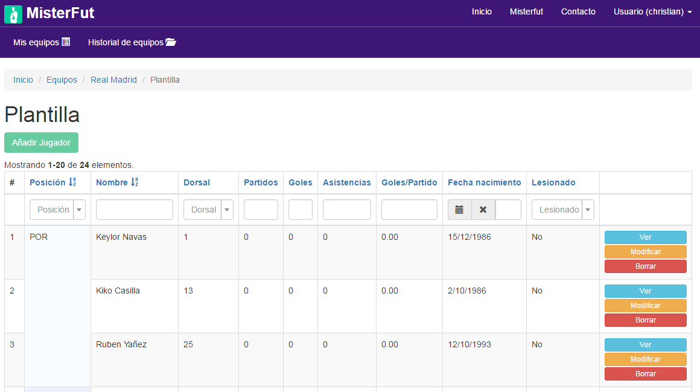

-----------------------------------------------
### Ver ficha del equipo

Pulsando sobre el botón de "Ver", podra ver los datos de un equipo.

En esta pantalla aparecerán cuatro pestañas.

##### Datos

En la primera ("Datos") de ellas podras ver los datos del equipo y modificar las estadísticas del equipo.

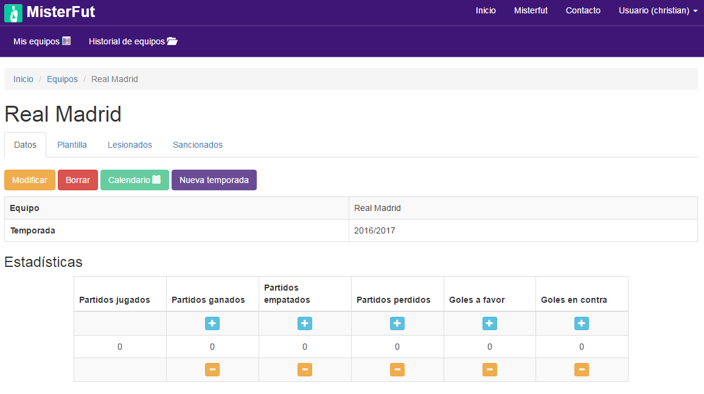

Desde esta pantalla también podras acceder al formulario de modificación del equipo o borrar el equipo.

Además, puedes ir al calendario del equipo o añadir una nueva temporada.

##### Plantilla

En la pestaña de "Plantilla" podras ver un cuadro resumen de la plantilla del equipo.

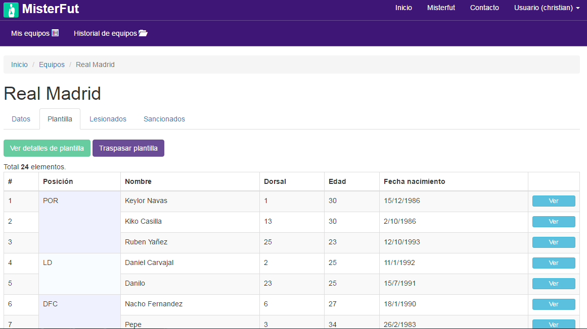

Además, en esta pestaña aparecerá un botón para acceder a la pantalla de los datos de la plantilla del equipo.

También tienes la opción de traspasar la plantilla de una de las temporadas de tus equipos a ese equipo en el que te encuentras.

##### Lesionados

En la tercera pestaña, podras ver un listado de los jugadores del equipo que están lesionados.

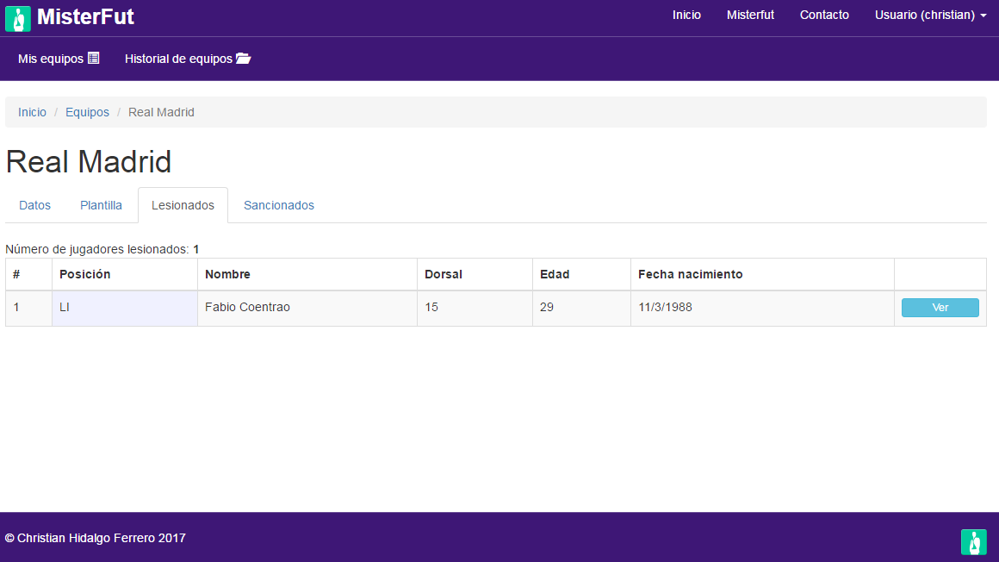

##### Sancionados

En la pestaña de "Sancionados", aparecerá un listado de los jugadores sancionados del equipo en el que te encuentras.

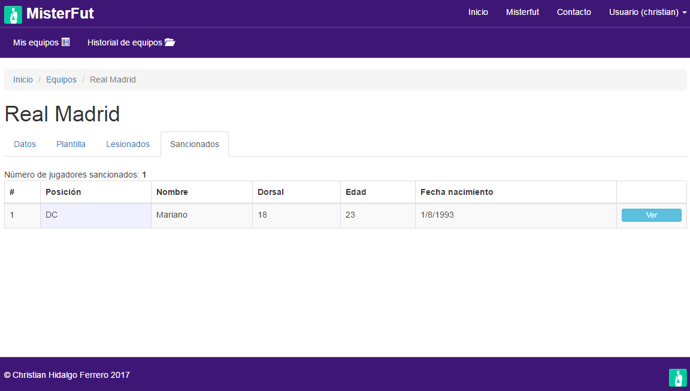

-----------------------------------------------
### Añadir nueva temporada

Al pulsar sobre el botón de "Nueva temporada", en la pestaña de "Datos", podras visualizar en pantalla un formulario en el que deberás introducir la temporada que quieres añadir al equipo.

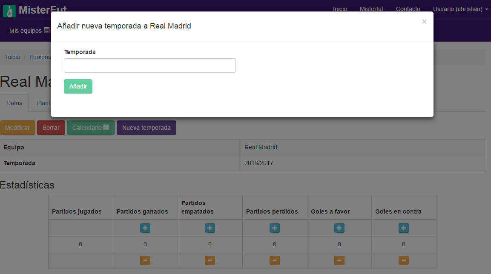

-----------------------------------------------
### Traspasar plantilla

Si pulsas sobre el botón de "Traspasar plantilla", que se encuentra el la pestaña de "Plantilla", se abrira en pantalla una nueva ventana donde deberas escoger el equipo de origen del que quieres realizar el traspaso masivo de la plantilla.

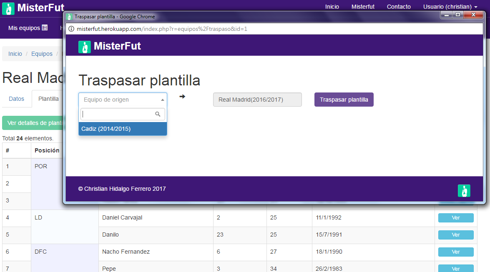

-----------------------------------------------
### Calendario

Para acceder al calendario, tienes que pulsar sobre el botón de "Calendario" que aparece en la pestaña de "Datos".

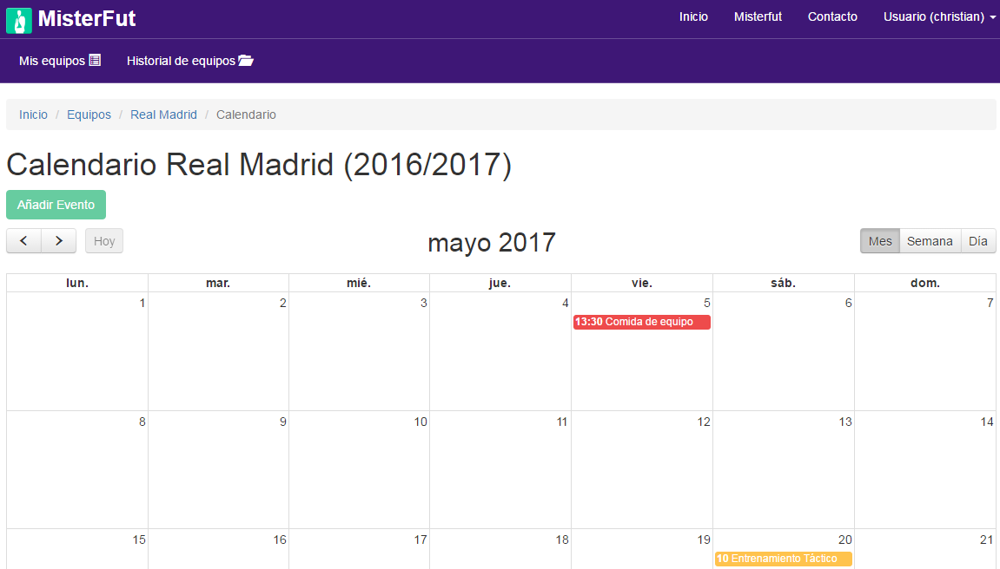

En esta pantalla aparece un calendario con los eventos del equipo en el que te encuentras.

Este calendario dispone de tres vistas, un mensual, otra semanal y otra diaria.

Para alternar entre estas tres vistas disponibles solo tienes que pulsar sobre los botones de "Mes", "Semana" o "Día", que aparecen arriba del calendario, en la parte derercha.

-----------------------------------------------
### Añadir un evento

Para añadir un nuevo evento tienes dos opciones, la primera es pulsar sobre el botón de "Añadir evento" situado en la parte superior, y la segunda es pulsar sobre cualquier día del calendario. En ambos casos se abrira en pantalla el formulario para añadir un nuevo evento, con la única diferencia de que si lo haces pulsando sobre un día del calendario no sera necesario que introduzcas el día de inicio del evento.

-----------------------------------------------
### Ver detalle de un evento y modificar un evento

Para ver el detalle de un evento, solo tienes que pulsar sobre el evento deseado y te aparecerá en pantalla una vista detallada del evento sobre el que has pulsado.

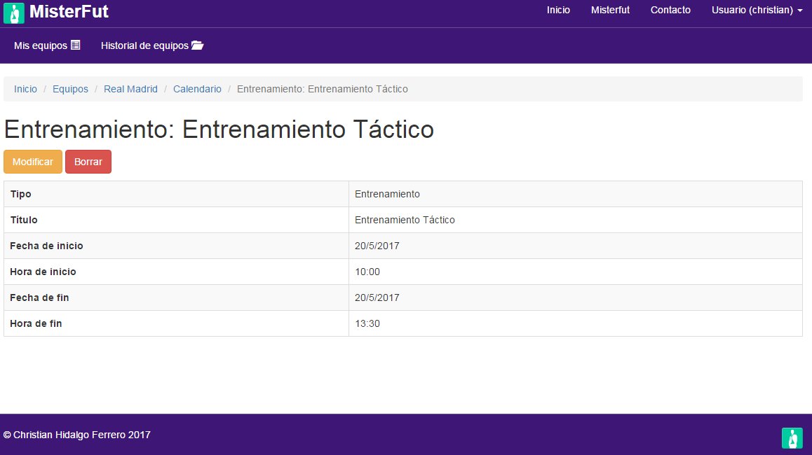

Además, desde esta pantalla podras  borrar el evento, pulsando sobre el botón de "Borrar" o acceder al formulario de modificación del evento, pulsando sobre el botón de "Modificar".

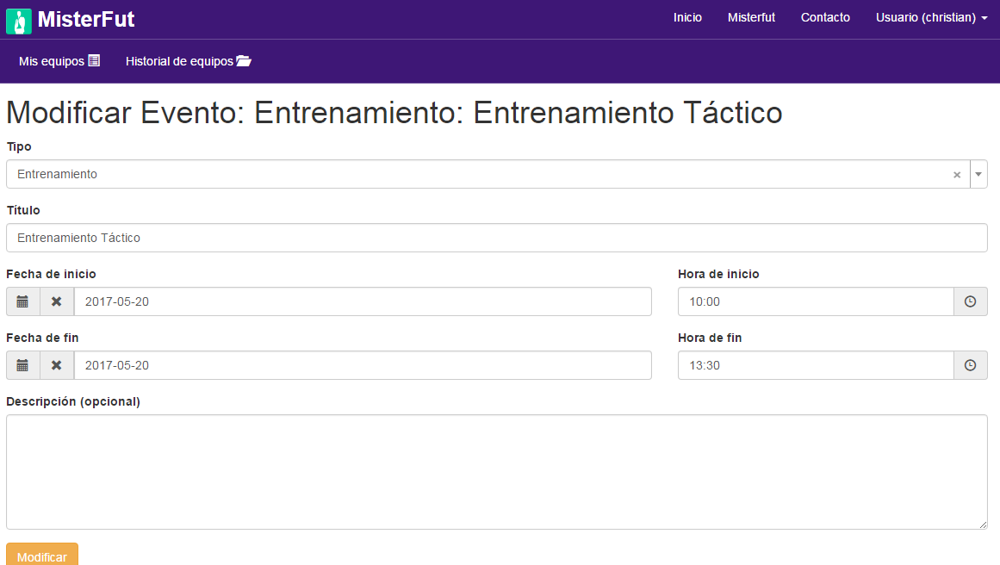

-----------------------------------------------
### Historial de equipos

Pulsando sobre la opción del submenú de "Historial de equipos" accederas a la pantalla donde encontraras un listado de los diferentes equipos que has entrenado independientemente del número de temporadas que hayas sido entrenador de cada equipo.

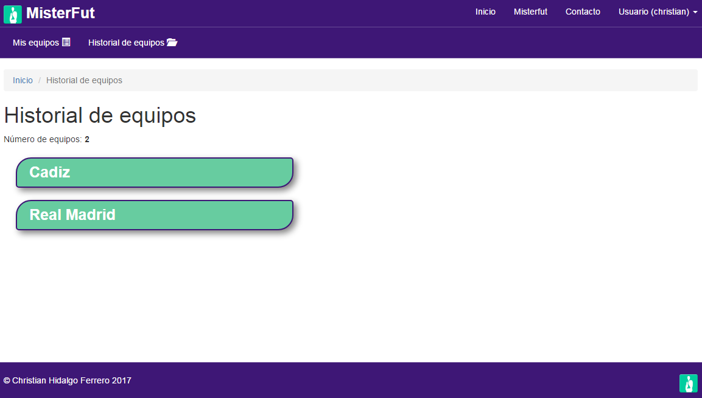

Al pulsar sobre alguno de los equipos que aparecen en el listado, podras ver una tabla con el histórico de estadísticas de cada temporada de ese equipo.

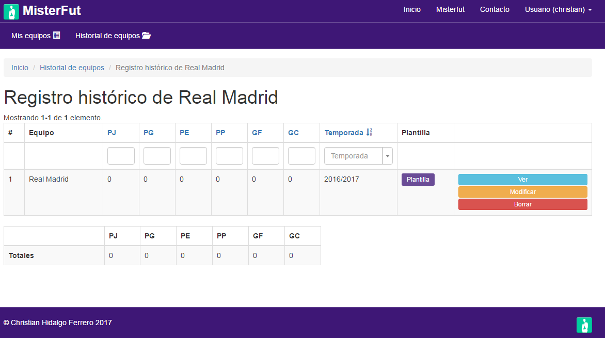
