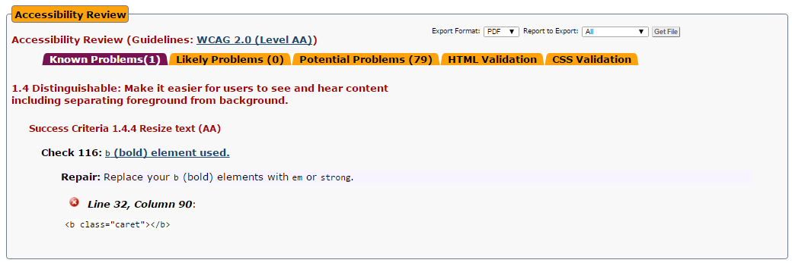
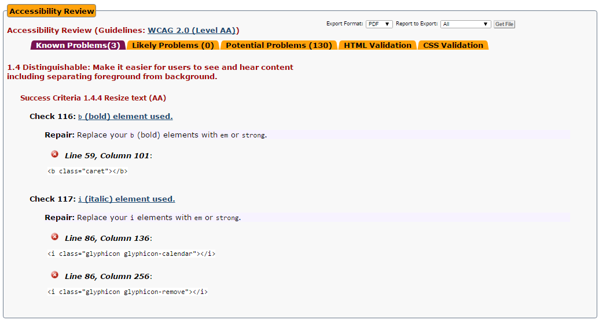
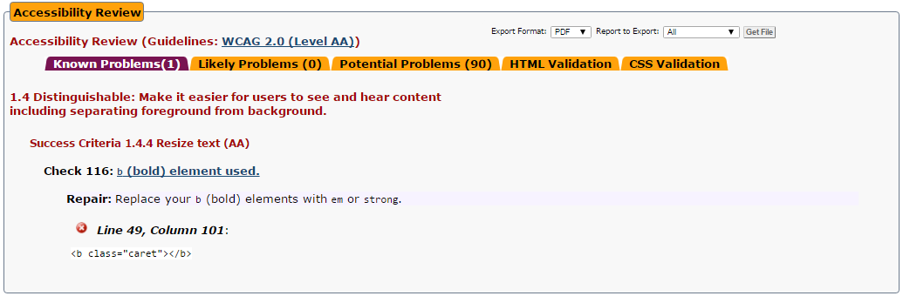

Anexo IV: Validación accesibilidad
========================

La validación sobre accesibilidad se ha llevado a cabo sobre las siguientes páginas:

[Index](http://misterfut.herokuapp.com/index.php)
---------

La página de index cumple el nivel AA de accesibilidad, solo presenta el error de utilización de la etiqueta `<b>`, la cual es generada automáticamente por el framework de Yii2 y no se puede cambiar.

-------------------------------------------------

[Añadir jugador](http://misterfut.herokuapp.com/index.php?r=jugadores%2Fcreate&id_equipo=1)
---------

La página de añadir jugador cumple el nivel AA de accesibilidad, solo presenta el error de utilización de la etiqueta `<b>` y la etiqueta `<i>`, las cuales son generadas automáticamente por el framework de Yii2 y por los iconos de bootstrap y no se pueden cambiar.

-------------------------------------------------

[Calendario](http://misterfut.herokuapp.com/index.php?r=eventos%2Findex&idEquipo=1)
---------

La página del calendario cumple el nivel AA de accesibilidad, solo presenta el error de utilización de la etiqueta `<b>`, la cual es generada automáticamente por el framework de Yii2 y no se puede cambiar.

-------------------------------------------------

[Añadir evento](http://misterfut.herokuapp.com/index.php?r=eventos%2Fcreate&idEquipo=1)
---------

La página de añadir evento cumple el nivel AA de accesibilidad, solo presenta el error de utilización de la etiqueta `<b>` y la etiqueta `<i>`, las cuales son generadas automáticamente por el framework de Yii2 y por los iconos de bootstrap y no se pueden cambiar.

-------------------------------------------------

[Historial de equipos](http://misterfut.herokuapp.com/index.php?r=equipos%2Fhistorial)
---------

La página del historial de equipos cumple el nivel AA de accesibilidad, solo presenta el error de utilización de la etiqueta `<b>`, la cual es generada automáticamente por el framework de Yii2 y no se puede cambiar.

-------------------------------------------------

[Añadir ejercicio](http://misterfut.herokuapp.com/index.php?r=ejercicios%2Fcreate)
---------

La página del historial de equipos cumple el nivel AA de accesibilidad, solo presenta el error de utilización de la etiqueta `<b>`, la cual es generada automáticamente por el framework de Yii2 y no se puede cambiar.

-------------------------------------------------

Conclusión
-----------------

En resumen, las páginas validadas cumplen el nivel de accesibilidad exigido perfectamente, excepto por el detalle de las etiquetas `<b>` e `<i>`, las cuales no deberían ser utilizadas según las especificaciones de HTML5 pero el framework Yii2 las genera automaticamente.
