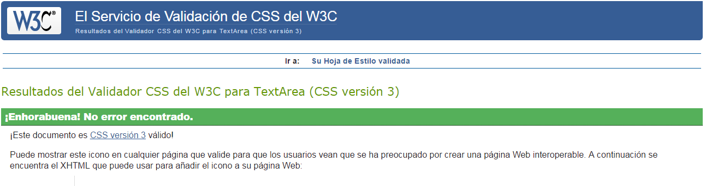
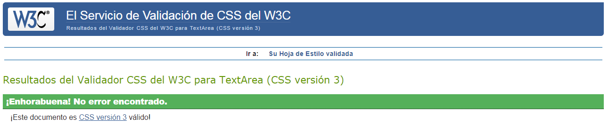
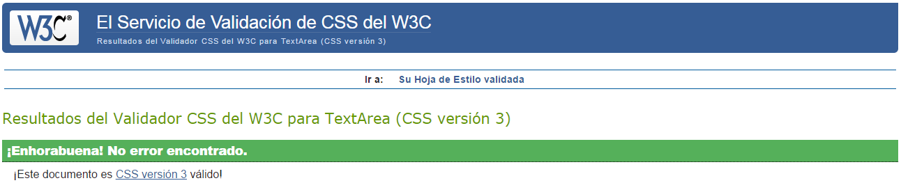
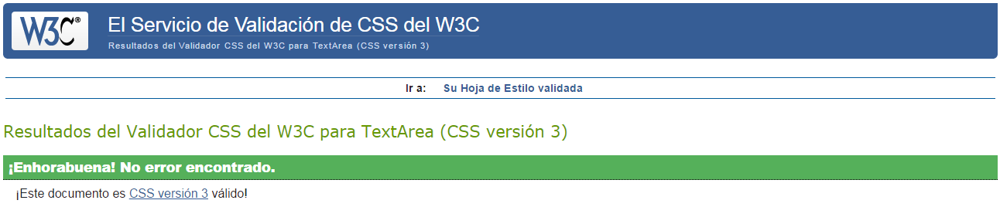
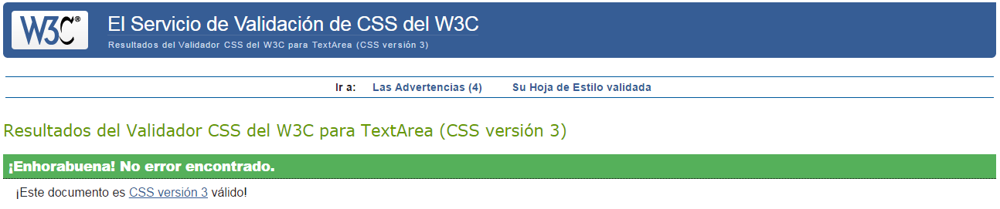

Anexo II: Validación CSS
========================

La validación CSS se ha realizado sobre los siguientes archivos:

about.css
---------

-------------------------------------------------

estadisticas.css
---------

-------------------------------------------------

index-contenido.css
---------

-------------------------------------------------

pelota.css
---------

-------------------------------------------------

site.css
---------

-------------------------------------------------

Conclusión
-----------

Todos los archivos CSS han sido validados correctamente.
