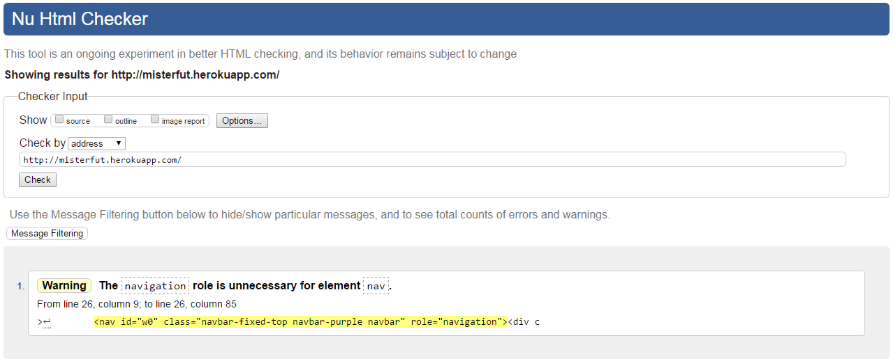
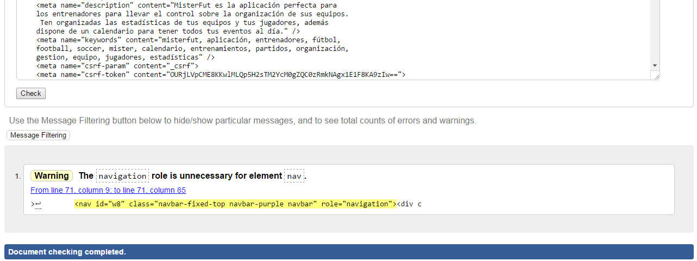
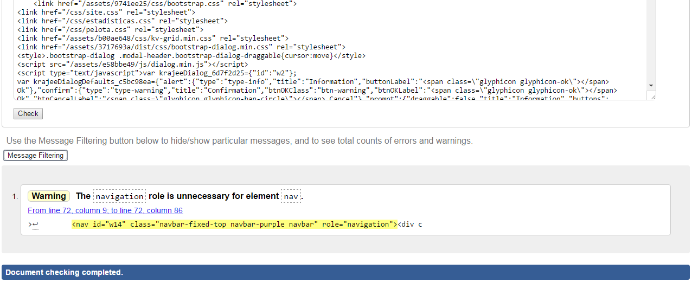
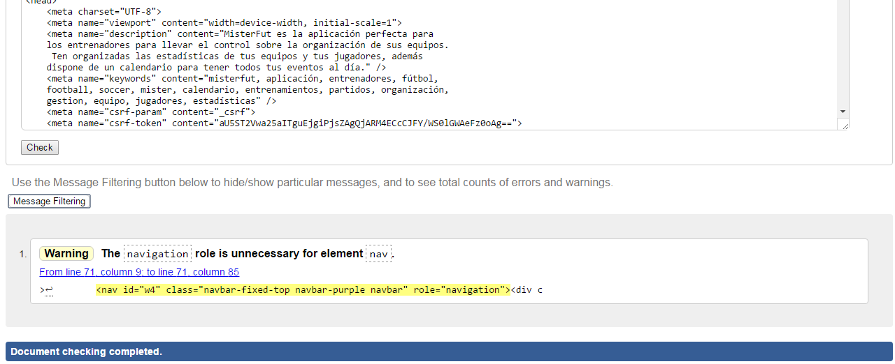
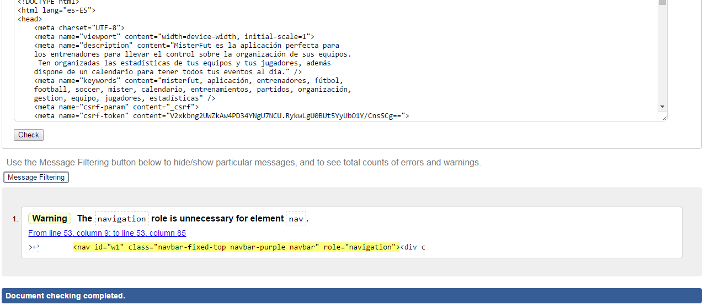
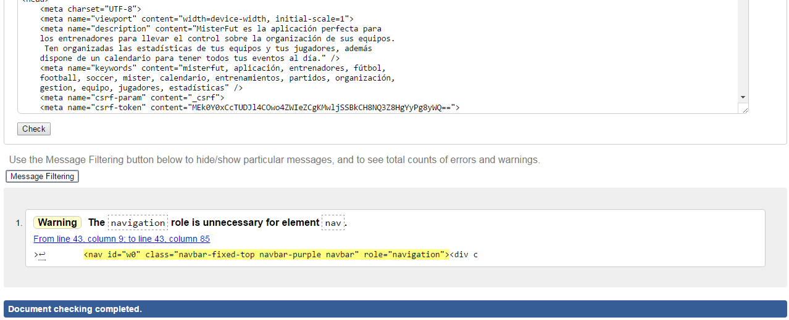
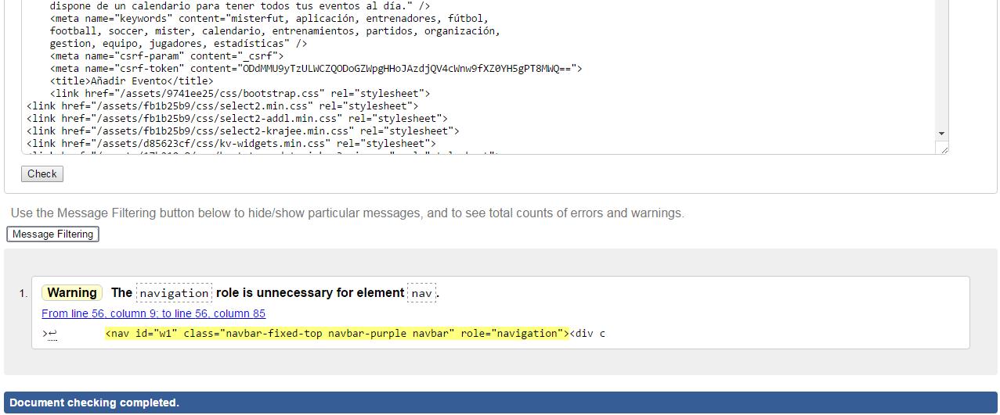
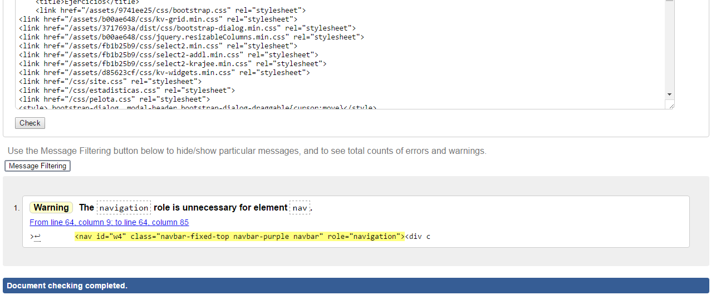
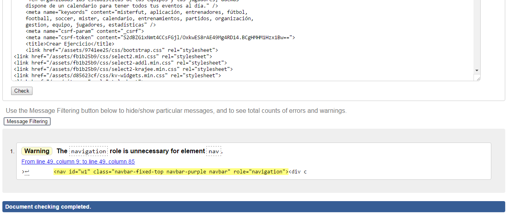

Anexo III: Validación HTML
========================

La validación html se ha llevado a cabo sobre las siguientes páginas:

[Index](http://misterfut.herokuapp.com/index.php)
---------

-------------------------------------------------

[Mis equipos](http://misterfut.herokuapp.com/index.php?r=equipos%2Findex)
---------

-------------------------------------------------

[Ver equipo](http://misterfut.herokuapp.com/index.php?r=equipos%2Fview&id=1)
---------

-------------------------------------------------

[Plantilla](http://misterfut.herokuapp.com/index.php?r=jugadores%2Findex&id_equipo=1)
---------

-------------------------------------------------

[Añadir jugador](http://misterfut.herokuapp.com/index.php?r=jugadores%2Fcreate&id_equipo=1)
---------

-------------------------------------------------

[Calendario](http://misterfut.herokuapp.com/index.php?r=eventos%2Findex&idEquipo=1)
---------

-------------------------------------------------

[Añadir evento](http://misterfut.herokuapp.com/index.php?r=eventos%2Fcreate&idEquipo=1)
---------

-------------------------------------------------

[Historial de equipos](http://misterfut.herokuapp.com/index.php?r=equipos%2Fhistorial)
---------

-------------------------------------------------

[Ejercicios](http://misterfut.herokuapp.com/index.php?r=ejercicios%2Findex)
---------

-------------------------------------------------

[Añadir ejercicio](http://misterfut.herokuapp.com/index.php?r=ejercicios%2Fcreate)
---------

-------------------------------------------------

Conclusión
-----------------

En resumen, todas las páginas validadas han pasado correctamente la validación, exceptuando el caso del "warning" que aparece en todas las páginas sobre el `role="navigation"` que tiene asignado la etiqueta `<nav>`, el cual es generado automaticamente por el framework Yii2 y no se puede eliminar.
